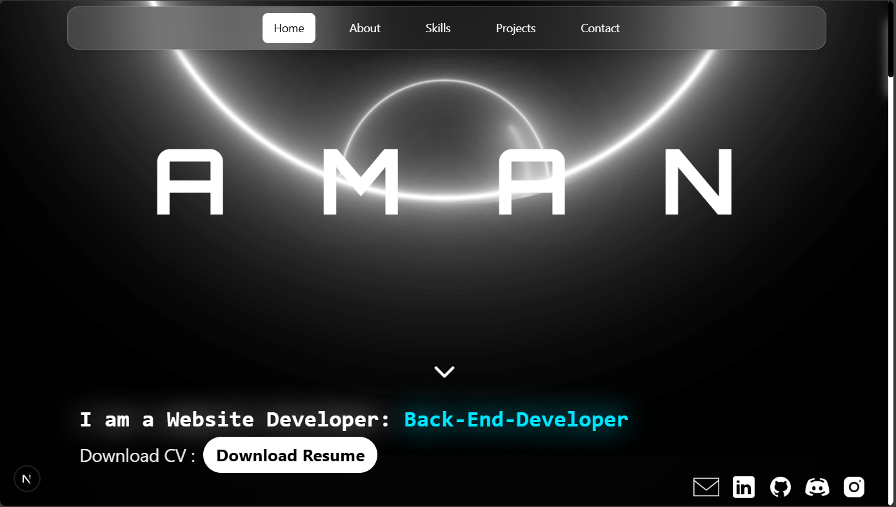
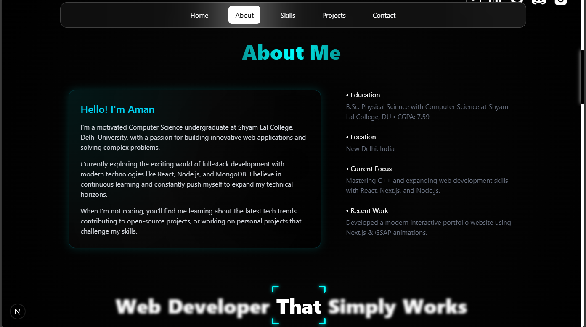
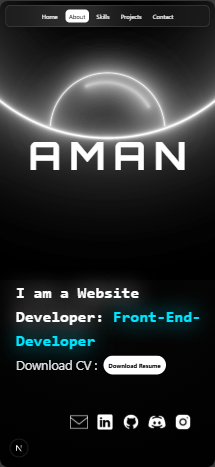
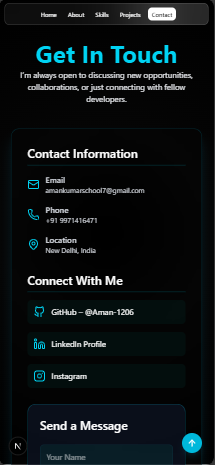

# 🚀 Personal Portfolio Website

A modern, fully responsive, and animated portfolio website built to showcase my skills, projects, and experience as a Web Developer. This portfolio is designed with smooth animations, clean UI, and complete responsiveness across all devices.

---

## 🌐 Live Demo

👉 *Add your deployed URL here*

---

## ✨ Features

* ✅ **Modern & Animated UI** using smooth transitions and professional styling
* ✅ **Fully Responsive** — looks perfect on mobile, tablet, and desktop
* ✅ **Home, About, Skills, Projects, and Contact Sections**
* ✅ **Dynamic Tech Stack Cards**
* ✅ **Professional About Section** with education, location, focus areas
* ✅ **Download Resume/CV Button**
* ✅ **Working Contact Form** (can be integrated with backend/email services)
* ✅ **Social Media & Developer Profile Links**
* ✅ **Clean, modular code structure** (Next.js / React based)

---

## 🖼️ Screenshots








---

## 🛠️ Tech Stack

### **Frontend:**

* HTML
* CSS / TailwindCSS
* JavaScript
* React.js / Next.js
* GSAP/Lenis/motion(for animations)

### **Backend (Optional / Planned):**

* Node.js
* Express.js
* MongoDB/Mongoosh(for storing contact form messages)

### **Tools & Platforms:**

* Git & GitHub
* VS Code
* Vercel (for deployment)

---

## 📁 Project Structure

```
project-folder/
│
├── public/
├── src/
│   ├── components/
│   ├── pages/
│   ├── styles/
│   ├── utils/
│
├── package.json
├── README.md
└── ...
```

---

## ⚙️ Installation & Setup

```bash
# Clone the repo
git clone https://github.com/your-username/your-portfolio.git
cd your-portfolio

# Install dependencies
npm install

# Start development server
npm run dev

# Build for production
npm run build
```

---

## 📬 Contact

[](mailto:amankumarschool7@gmail.com)
[](https://github.com/Aman-1206)
[](https://www.linkedin.com/in/aman-kumar-a2ba54361)
[](https://www.instagram.com/aman.cpp_/)

<!-- Replace the LinkedIn and Instagram URLs above with your actual profile URLs before pushing -->

## 🤝 Contributing

This is a personal project, but contributions, suggestions, and improvements are always welcome.

---

## 📝 License

This project is open-source and available under the MIT License.

---

### ⭐ If you like this project, don't forget to star the repository!
